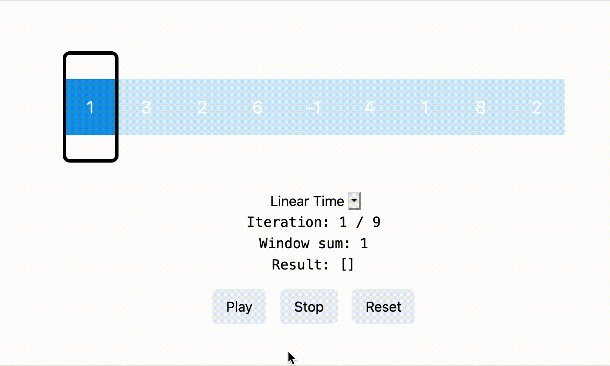

# Visualizer

  

A visualizer for common algorithm patterns made with React, Tailwind, and Framer Motion. Check it out now: https://visualizer-sepia.vercel.app/patterns/sliding-window/find-all-averages

> DISCLAIMER: This project is very much still a WIP so the design is not polished whatsoever and things may break. Check back regularly for updates!
