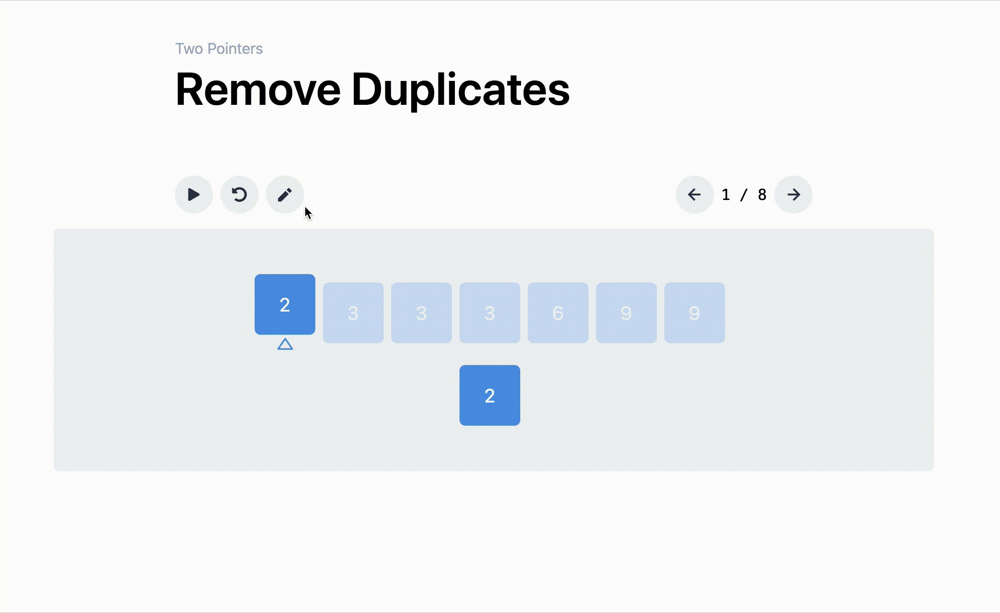

# Visualizer

  

A visualizer for common algorithm patterns made with Next.js, Tailwind, and Framer Motion, based off the patterns described in the [Grokking the Coding Interview](https://www.educative.io/courses/grokking-the-coding-interview) course on Educative. The visualizer comes packed with editable inputs, steppable animations and configurable animations. [Check it out now!](https://visualizer-sepia.vercel.app/patterns/sliding-window/find-all-averages)

> DISCLAIMER: This project is very much still a WIP so the design is not polished, not optimized for mobile, features are missing, etc. Check back regularly for updates!

## Roadmap

I'm currently actively working on this but between school, work, and other commitments, features are coming along slowly. Nevertheless the two main features I'm working towards include:

- Implementing a skeleton for _every_ pattern described in Grokking the Coding Interview, and
- Integrating some form of post or text that goes along with the visualization.
